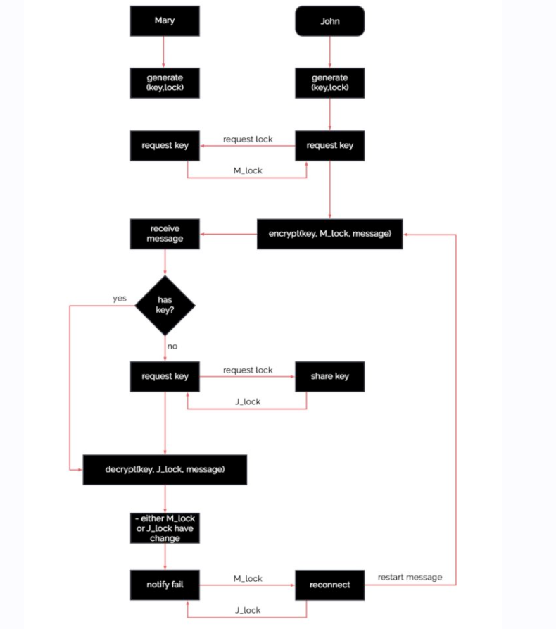
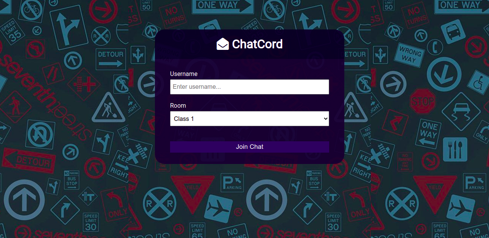
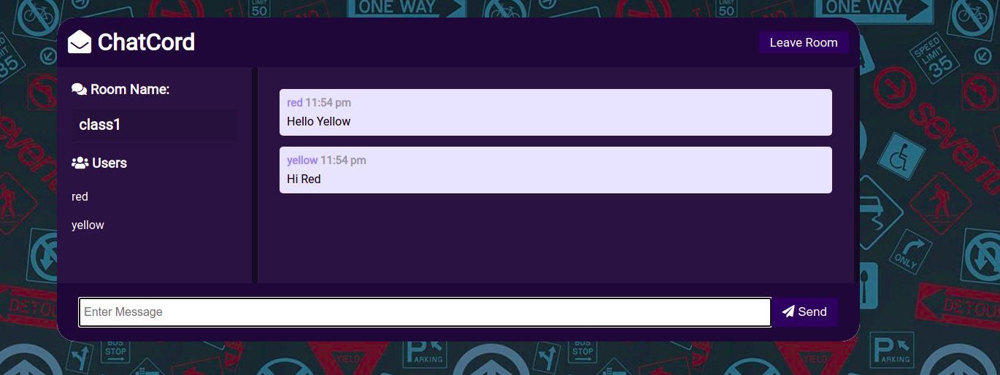

# E2E-Online-Group-Chat-app

## Description
An end-to-end encrypted group chat system. Uses asymmetric encryption for securing key exchange and symmetric encryption for encrypting the chats 

## How to run the code?
Execute the following commands
1. `npm install`
2. `npm run start`

## Output
- Program Design

- Demonstration
    
    
